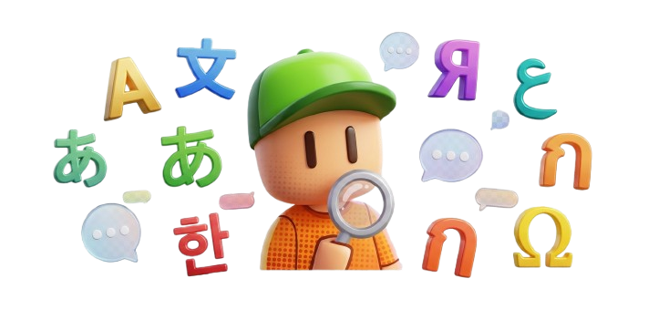

<div align="center">



# Stumble Labs Translations

**Help bring the Stumble Labs website to your language.**

Every piece of text you see on the site lives here as a simple key/value file.
Translate the values, open a pull request, and once it is merged your language
ships to the site.

[](https://github.com/StumbleLabs/stumble-labs-i18n/actions/workflows/i18n-check.yml)
&nbsp;·&nbsp; **English is the source language** &nbsp;·&nbsp; PRs welcome

</div>

---

## Languages

| Language | Code | File | Status |
|----------|------|------|--------|
| English (source) | `en` | `locales/en.json` | reference |
| _yours here_ | `xx` | `locales/xx.json` | open a PR |

Codes follow [BCP 47](https://www.rfc-editor.org/info/bcp47): `es`, `fr`, `de`,
`ja`, `pt-BR`, and so on. The file name is the code plus `.json`.

## How it works

```
        this repo (public)                          the website (private)
  ┌──────────────────────────┐                 ┌───────────────────────────┐
  │ locales/en.json  (source)│  ◄── synced ──  │ new UI text is written    │
  │ locales/es.json  (you)   │                 │ in English first          │
  │ locales/fr.json  (you)   │  ── merged ──►  │ picked up and deployed    │
  └──────────────────────────┘                 └───────────────────────────┘
```

1. `locales/en.json` is kept in sync from the website. It is the single source
   of truth for the list of keys.
2. You translate the values into a language file.
3. A GitHub check confirms your file has every key and keeps all placeholders
   intact.
4. A maintainer reviews and merges. The website picks the translation up on its
   next release.

Nothing you do here can break the live site. Any text a translation is missing
falls back to English automatically.

## Add a new language

1. **Fork** this repository.
2. **Copy** `locales/en.json` to `locales/<code>.json`
   (for Spanish that is `locales/es.json`).
3. **Translate the values only.** Keep the keys, the `{{placeholders}}`, and any
   `<b>`, `<i>`, `<color=...>` tags exactly as they are (see the rules below).
4. **Check your work** locally if you have Node installed:
   ```bash
   npm run check
   ```
5. **Open a pull request.** The i18n check runs automatically and tells you if a
   key or placeholder is off.

Want the language to appear in the site's language switcher too? Mention it in
your PR and a maintainer will register it (one line of config plus a flag icon).

## Improve an existing language

Open `locales/<code>.json`, fix or refine the strings, run `npm run check`, and
open a PR. Small fixes are very welcome.

## Three rules that keep translations safe

**1. Never change the keys.** Only translate the text on the right side.

```jsonc
// en.json
"lastOnline": "Last online {{time}}"

// es.json  (correct)
"lastOnline": "Conectado por última vez {{time}}"

// es.json  (wrong: the key was renamed)
"ultimaConexion": "Conectado por última vez {{time}}"
```

**2. Keep every `{{placeholder}}`.** They get replaced with real values at
runtime. Move them, do not remove them.

```jsonc
// en.json
"rpToGo": "{{n}} RP to go"

// es.json  (correct: placeholder kept)
"rpToGo": "Faltan {{n}} RP"

// es.json  (wrong: {{n}} was dropped, the number disappears)
"rpToGo": "Faltan algunos RP"
```

**3. Do not edit `locales/en.json`.** English is generated from the website. If a
source string reads badly, note it in your PR instead of editing it here.

## Validate locally (optional)

You only need [Node.js](https://nodejs.org) 18 or newer. No dependencies to
install.

```bash
npm run check
```

Example output:

```
Reference: en.json (905 keys)

  ok    es.json  (100% complete)
  fail  fr.json  (98% complete)
        missing 14 key(s):
          - hof.filter.rarity
          ...
```

## Questions

**I only speak my language, not English perfectly. Can I still help?**
Yes. Translate what you are confident about. Partial translations are fine, the
rest stays in English until someone fills it in.

**My PR check is red. What now?**
Read the check output: it lists the exact keys that are missing or the
placeholders that changed. Fix those lines and push again.

**How do I add my language to the switcher on the site?**
Ask in your PR. That part lives in the website repo and a maintainer handles it.

---

<div align="center">
Thank you for helping more players enjoy Stumble Labs in their own language. 💛
</div>
